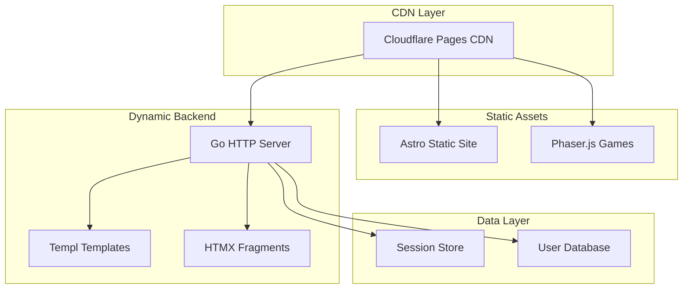

# Design Document

## Overview

Compify MVP is a competition website built using a monorepo architecture with clear separation of concerns. The system consists of three main applications: a static marketing site (Astro), a server-driven backend (Go + HTMX), and an isolated game sandbox (Phaser.js). The architecture prioritizes simplicity, performance, and cost-efficiency while maintaining strict boundaries between components.

The design follows a "boring technology" philosophy, emphasizing proven patterns over cutting-edge solutions. Server-side rendering dominates the architecture, with minimal client-side JavaScript used only where absolutely necessary.

## Architecture

### High-Level Architecture



### Monorepo Structure

The system uses a single Git repository with multiple independently deployable applications:

```
compify/
├── apps/
│   ├── web-static/        # Astro marketing site
│   │   ├── src/
│   │   │   ├── pages/     # Static pages
│   │   │   ├── layouts/   # Page layouts
│   │   │   └── components/ # Reusable components
│   │   └── astro.config.mjs
│   ├── backend/           # Go server
│   │   ├── cmd/
│   │   ├── internal/
│   │   │   ├── handlers/  # HTTP handlers
│   │   │   ├── templates/ # Templ templates
│   │   │   ├── auth/      # Authentication logic
│   │   │   └── models/    # Data models
│   │   └── go.mod
│   └── sandbox/           # Phaser games
│       ├── src/
│       │   ├── scenes/    # Game scenes
│       │   ├── assets/    # Game assets
│       │   └── main.js    # Entry point
│       └── dist/          # Built game files
├── shared/
│   ├── assets/            # Common assets
│   └── constants/         # Shared constants
└── infra/
    └── deployment-notes.md
```

### Communication Patterns

Applications communicate exclusively through HTTP:
- **Static Site → Backend**: Direct HTTP requests for authentication flows
- **Dashboard → Backend**: HTMX-driven partial updates via HTTP
- **Sandbox → Backend**: Future API integration (not in MVP)
- **No direct imports** between applications

## Components and Interfaces

### Static Site (Astro)

**Responsibilities:**
- Marketing pages (Home, About, Rules, Timeline, Sponsors, FAQ)
- SEO optimization and meta tag management
- Static asset serving through CDN
- Initial user acquisition funnel

**Key Components:**
- `Layout.astro`: Base layout with SEO meta tags
- `Navigation.astro`: Site navigation component
- `Hero.astro`: Landing page hero section
- `CompetitionInfo.astro`: Competition details component

**Interface Contracts:**
- Serves static HTML with zero JavaScript hydration
- Links to backend authentication endpoints
- Maintains consistent branding and navigation

### Backend Server (Go + Templ + HTMX)

**Responsibilities:**
- User authentication and session management
- Dashboard rendering and partial updates
- CRUD operations for user data
- HTML fragment generation for HTMX

**Key Components:**

```go
// HTTP Server Structure
type Server struct {
    router     *http.ServeMux
    templates  *template.Registry
    auth       *auth.Service
    sessions   *session.Store
}

// Authentication Service
type AuthService struct {
    users    UserRepository
    sessions SessionRepository
    hasher   PasswordHasher
}

// Template Registry
type TemplateRegistry struct {
    templates map[string]*templ.Component
    cache     bool
}
```

**HTMX Integration Patterns:**
- Return HTML fragments, never JSON
- Use `hx-get`, `hx-post`, `hx-swap` attributes
- Implement progressive enhancement
- Handle errors through HTML responses

**Template Structure:**
```go
// Dashboard template example
templ Dashboard(user User, data DashboardData) {
    <div id="dashboard-content">
        @ProfileSection(user)
        @RegistrationStatus(data.Registration)
        @Announcements(data.Announcements)
    </div>
}

// Partial update template
templ ProfileSection(user User) {
    <section hx-target="this" hx-swap="outerHTML">
        <h2>Profile</h2>
        <form hx-post="/profile/update">
            <!-- Profile form fields -->
        </form>
    </section>
}
```

### Game Sandbox (Phaser.js)

**Responsibilities:**
- Browser-based 2D game implementation
- Asset loading and management
- Game state management (client-side only)
- Future integration points for backend communication

**Architecture:**
```javascript
// Game configuration
const gameConfig = {
    type: Phaser.AUTO,
    width: 800,
    height: 600,
    physics: {
        default: 'arcade',
        arcade: { gravity: { y: 300 }, debug: false }
    },
    scene: [MenuScene, GameScene, GameOverScene]
};

// Scene structure
class GameScene extends Phaser.Scene {
    constructor() {
        super({ key: 'GameScene' });
    }
    
    preload() {
        // Asset loading
    }
    
    create() {
        // Game object initialization
    }
    
    update() {
        // Game loop logic
    }
}
```

**Deployment Strategy:**
- Built as static assets
- Served through CDN
- No server dependencies for MVP
- Isolated from authentication system

## Data Models

### User Model

```go
type User struct {
    ID          string    `json:"id" db:"id"`
    Email       string    `json:"email" db:"email"`
    Username    string    `json:"username" db:"username"`
    PasswordHash string   `json:"-" db:"password_hash"`
    CreatedAt   time.Time `json:"created_at" db:"created_at"`
    UpdatedAt   time.Time `json:"updated_at" db:"updated_at"`
    Profile     Profile   `json:"profile"`
}

type Profile struct {
    FirstName   string `json:"first_name" db:"first_name"`
    LastName    string `json:"last_name" db:"last_name"`
    Bio         string `json:"bio" db:"bio"`
    AvatarURL   string `json:"avatar_url" db:"avatar_url"`
}
```

### Session Model

```go
type Session struct {
    ID        string    `json:"id" db:"id"`
    UserID    string    `json:"user_id" db:"user_id"`
    Token     string    `json:"token" db:"token"`
    ExpiresAt time.Time `json:"expires_at" db:"expires_at"`
    CreatedAt time.Time `json:"created_at" db:"created_at"`
}
```

### Registration Model

```go
type Registration struct {
    ID           string    `json:"id" db:"id"`
    UserID       string    `json:"user_id" db:"user_id"`
    CompetitionID string   `json:"competition_id" db:"competition_id"`
    Status       string    `json:"status" db:"status"` // pending, confirmed, cancelled
    RegisteredAt time.Time `json:"registered_at" db:"registered_at"`
    Data         map[string]interface{} `json:"data" db:"data"` // Competition-specific data
}
```

### Dashboard Data Model

```go
type DashboardData struct {
    User          User           `json:"user"`
    Registration  *Registration  `json:"registration"`
    Announcements []Announcement `json:"announcements"`
    Stats         UserStats      `json:"stats"`
}

type Announcement struct {
    ID        string    `json:"id"`
    Title     string    `json:"title"`
    Content   string    `json:"content"`
    Priority  string    `json:"priority"` // low, medium, high
    CreatedAt time.Time `json:"created_at"`
}
```

## Correctness Properties

*A property is a characteristic or behavior that should hold true across all valid executions of a system—essentially, a formal statement about what the system should do. Properties serve as the bridge between human-readable specifications and machine-verifiable correctness guarantees.*

### Converting EARS to Properties

Based on the prework analysis, I'll convert the testable acceptance criteria into universally quantified properties, consolidating redundant properties for efficiency:

**Property 1: Static HTML Generation Without Hydration**
*For any* marketing page generated by the Static_Site, the output should be static HTML without client-side framework hydration scripts or dynamic JavaScript initialization code.
**Validates: Requirements 1.1, 1.5, 6.1**

**Property 2: SEO Meta Tag Completeness**
*For any* page generated by the Static_Site, the HTML should contain all required SEO meta tags including title, description, and Open Graph tags.
**Validates: Requirements 1.3**

**Property 3: Authentication Flow Correctness**
*For any* valid user credentials, the authentication flow (registration → login → logout) should create sessions on login, maintain session state during authenticated requests, and properly invalidate sessions on logout.
**Validates: Requirements 2.1, 2.2, 2.3**

**Property 4: Server-Side Authentication Authority**
*For any* authentication operation, all authentication logic and session management should occur server-side without client-side authentication dependencies.
**Validates: Requirements 2.4, 7.1**

**Property 5: Error Handling Security**
*For any* invalid authentication attempt, the system should return appropriate error messages without exposing internal system details or implementation specifics.
**Validates: Requirements 2.5**

**Property 6: Dashboard Server-Side Rendering**
*For any* authenticated user accessing the dashboard, the complete dashboard should be rendered as server-side HTML containing all required sections (profile, registration status, announcements).
**Validates: Requirements 3.1, 3.3**

**Property 7: HTMX Partial Update Correctness**
*For any* dashboard update operation, HTMX requests should return HTML fragments (not JSON) that correctly update the targeted DOM elements without full page reloads.
**Validates: Requirements 3.2, 3.4, 6.5**

**Property 8: Minimal JavaScript Usage**
*For any* dashboard page, the generated HTML should contain minimal JavaScript code, relying primarily on HTMX attributes for interactivity.
**Validates: Requirements 3.5**

**Property 9: Sandbox Independence**
*For any* sandbox game access, the game should load and operate without authentication dependencies, database storage, or server-side state persistence.
**Validates: Requirements 4.2, 4.3**

**Property 10: Component Isolation**
*For any* application component (static, backend, sandbox), the code should not contain direct imports or dependencies from other application components, communicating only via HTTP.
**Validates: Requirements 5.2, 5.5, 7.2, 7.4**

**Property 11: Rendering Strategy Compliance**
*For any* page or component, it should use only its designated rendering strategy: static rendering for marketing pages, server-driven rendering for authentication/dashboard, and client-driven rendering for games.
**Validates: Requirements 6.2, 6.3, 6.4**

**Property 12: Server-Authoritative State Management**
*For any* shared state synchronization, the server should be the authoritative source of truth, with clients owning only temporary UI state and game state.
**Validates: Requirements 7.3, 7.5**

**Property 13: Caching Strategy Implementation**
*For any* cacheable resource, appropriate cache headers and caching mechanisms should be implemented to optimize performance and cost efficiency.
**Validates: Requirements 8.3**

**Property 14: Technology Stack Compliance**
*For any* application component, it should use only the designated technology stack: Astro for static sites, Go+Templ for backend, HTMX for server-driven UI, and Phaser.js for games.
**Validates: Requirements 9.1, 9.2, 9.3, 9.4**

**Property 15: Single Binary Deployment**
*For any* backend deployment, the application should be buildable as a single Go binary that uses environment variables for configuration without requiring complex orchestration.
**Validates: Requirements 10.3, 10.5**

## Error Handling

### Authentication Errors

**Session Management:**
- Invalid sessions redirect to login page
- Expired sessions are automatically cleaned up
- Session cookies use secure, httpOnly flags
- CSRF protection for state-changing operations

**Input Validation:**
- Server-side validation for all user inputs
- Sanitization of HTML content in user-generated data
- Rate limiting for authentication attempts
- Proper error messages without information disclosure

### HTMX Error Handling

**Network Errors:**
- Graceful degradation when HTMX requests fail
- Retry mechanisms for transient failures
- User feedback for permanent failures
- Fallback to full page refresh when necessary

**Server Errors:**
- HTML error fragments for HTMX responses
- Consistent error styling and messaging
- Logging of server-side errors for debugging
- User-friendly error messages

### Game Error Handling

**Asset Loading:**
- Graceful handling of missing game assets
- Loading progress indicators
- Fallback assets for critical game elements
- Error reporting for debugging

**Runtime Errors:**
- Game state recovery mechanisms
- Error boundaries to prevent crashes
- User notification of game errors
- Automatic game restart capabilities

## Testing Strategy

### Dual Testing Approach

The system employs both unit testing and property-based testing as complementary approaches:

**Unit Tests:**
- Verify specific examples and edge cases
- Test integration points between components
- Validate error conditions and boundary cases
- Focus on concrete scenarios and known failure modes

**Property-Based Tests:**
- Verify universal properties across all inputs
- Test system behavior with randomized inputs
- Validate architectural constraints and boundaries
- Ensure correctness properties hold under all conditions

### Property-Based Testing Configuration

**Framework Selection:**
- **Go Backend**: Use `gopter` library for property-based testing
- **JavaScript/Phaser**: Use `fast-check` library for property-based testing
- **Astro Build**: Use `fast-check` with Node.js for build output validation

**Test Configuration:**
- Minimum 100 iterations per property test
- Each property test references its design document property
- Tag format: **Feature: compify-mvp, Property {number}: {property_text}**
- Randomized input generation with smart constraints

**Property Test Implementation:**
Each correctness property must be implemented as a single property-based test that:
1. Generates appropriate random inputs for the property domain
2. Executes the system behavior being tested
3. Validates that the property holds for all generated inputs
4. Reports counterexamples when properties fail

**Unit Test Balance:**
- Focus unit tests on specific examples that demonstrate correct behavior
- Test critical edge cases that property tests might miss
- Validate integration points between system components
- Avoid over-testing scenarios already covered by property tests

### Test Organization

**Backend Tests:**
```go
// Property test example
func TestAuthenticationFlowCorrectness(t *testing.T) {
    // Feature: compify-mvp, Property 3: Authentication flow correctness
    properties := gopter.NewProperties(nil)
    properties.Property("valid credentials create and maintain sessions", 
        prop.ForAll(testAuthFlow, genValidCredentials()))
    properties.TestingRun(t, gopter.ConsoleReporter(false))
}
```

**Frontend Tests:**
```javascript
// Property test example
describe('Feature: compify-mvp, Property 1: Static HTML generation', () => {
    it('generates static HTML without hydration', () => {
        fc.assert(fc.property(
            fc.record({
                page: fc.constantFrom('home', 'about', 'rules', 'timeline'),
                content: fc.string()
            }),
            (pageData) => {
                const html = generatePage(pageData);
                return !containsHydrationScripts(html) && 
                       !containsClientFrameworkInit(html);
            }
        ), { numRuns: 100 });
    });
});
```

This comprehensive testing strategy ensures both specific correctness (unit tests) and general correctness (property tests) while maintaining clear traceability to requirements and design properties.